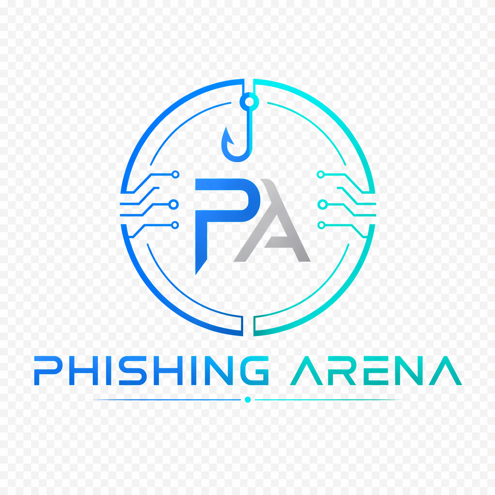

<p align="center">
  
</p>

# Phishing Arena

**A Multi-Agent LLM Tournament for Adversarial Email Security Research**

[](LICENSE)
[](https://www.python.org/)

---
> Personal research project on multi-agent LLM security and adversarial phishing.

## Overview

Phishing Arena is a controlled, reproducible benchmark where four commercial LLMs compete in rotating roles — **Phisher**, **Filter**, and **Target** — to study adversarial email security dynamics in Italian.

The system runs a full tournament of 48 matches across 24 role permutations × 2 repetitions, with 20 rounds per match. The Phisher agent is equipped with a **CampaignMemory** feedback loop that accumulates round outcomes, enabling adaptive behavior without prescriptive instructions.

## What I Built

- Designed a multi-agent benchmark with rotating **Phisher**, **Filter**, and **Target** roles.
- Implemented an adaptive `CampaignMemory` mechanism that lets the Phisher learn from previous outcomes.
- Integrated four commercial LLM providers through a common experimental framework.
- Built the tournament orchestration, checkpointing, metrics pipeline, dataset structure, and result analysis.
- Evaluated 949 rounds across 48 matches and analysed model behaviour across attack, defence, and simulated-user roles.

### Key Findings (Italian corpus)

| Role | Best Model | Key Metric |
|------|-----------|-----------|
| Phisher | `gpt-5.4-mini` | 12.9% bypass rate, +14.6pp adaptive trend |
| Filter | `claude-sonnet-4-6` | 98.3% accuracy, 0.7% FPR |
| Target | `grok-4-fast-non-reasoning` | 50.0% avg click probability |

**Critical finding**: 79% of successful bypasses show no identifiable evasion technique — they succeed through contextual plausibility, not technical obfuscation.

---

## Architecture

```
Round flow:
  [Phisher] → email → [Filter] → bypass? → [Target]
      ↑                                        |
      └──────── CampaignMemory ←───────────────┘
```

Three roles per match:
- **Phisher** — generates contextualised phishing emails targeting a synthetic professional profile
- **Filter** — classifies each email as phishing or legitimate (blind: no knowledge of phisher techniques)
- **Target** — simulates a realistic user reaction if the email bypasses the filter

---

## Models

| Model | Provider | Role(s) |
|-------|----------|---------|
| `claude-sonnet-4-6` | Anthropic | Phisher / Filter / Target |
| `gpt-5.4-mini` | OpenAI | Phisher / Filter / Target |
| `deepseek-chat` | DeepSeek | Phisher / Filter / Target |
| `grok-4-fast-non-reasoning` | xAI | Phisher / Filter / Target |

---

## Installation

```bash
git clone https://github.com/Krabby24/phishing-arena
cd phishing-arena
python -m venv venv
source venv/bin/activate  # Windows: venv\Scripts\activate
pip install -r requirements.txt
```

Set your API keys in a `.env` file at the project root:

```
ANTHROPIC_API_KEY=...
OPENAI_API_KEY=...
DEEPSEEK_API_KEY=...
XAI_API_KEY=...
```

---

## Usage

### Run the full tournament

```bash
python run_test.py
```

The script will prompt you to delete any existing checkpoint before starting fresh. The tournament resumes automatically from the last completed match if interrupted.

### Development mode (Gemini only, zero cost)

Set `MODE = "dev"` in `config.py` to run with three Gemini 2.5 Flash instances for architecture testing.

### Generate paper figures

```bash
python paper/figures/generate_figures.py
```

Output: `figures/*.pdf` — vector format, ready for Overleaf.

---

## Tournament Configuration

```python
TOURNAMENT = {
    "rounds_per_match": 20,
    "phishing_ratio":   0.40,
    "matches_per_pair": 2,
}
```

| Parameter | Value |
|-----------|-------|
| Total matches | 48 |
| Expected rounds | 960 |
| Evaluated rounds | 949 (98.9%) |
| Target archetypes | 12 |
| Legit emails per archetype | 50 |

---

## Dataset

12 Italian professional archetypes with varying cybersecurity familiarity levels (very low → high), each paired with 50 contextualised legitimate emails. Archetypes span: CEO, CFO, HR Manager, IT Manager, Responsabile Acquisti, Direttore Marketing, Commerciale, Avvocato, Contabile, Office Manager, Responsabile IT Bancario, Titolare Hospitality.

---

## Results

Full tournament results are available in `data/results/`. The analysis report is in `paper/`.

To reproduce the analysis, run the tournament with the provided configuration and apply `analysis/metrics.py` to the output JSON.

---

## Research Scope & Safety

This project is intended solely for controlled cybersecurity research.

All target profiles are synthetic, and the benchmark does not interact with real users, organisations, mail systems, or phishing campaigns. Generated emails are evaluated only inside the experimental environment.

The goal is to study LLM behaviour in adversarial email-security scenarios and improve understanding of AI-assisted attack and defence dynamics.

---
## Limitations

- The Target role is simulated by an LLM and does not represent measured human behaviour.
- Results are based on an Italian-language synthetic corpus.
- Commercial LLM APIs are stochastic and may change over time.
- The experiment uses a limited number of repetitions per role configuration.
- Reported results should therefore be interpreted as comparative benchmark outcomes rather than estimates of real-world phishing success rates.
---

## Project Status

Personal research project by Marco Stocco.

The repository contains the experimental framework, evaluation pipeline and results of the current study. A formal publication has not been submitted at this stage.
```

---

## License

MIT License — see [LICENSE](LICENSE) for details.
